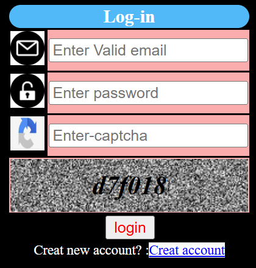
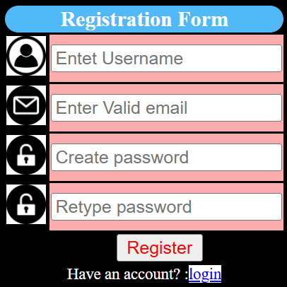
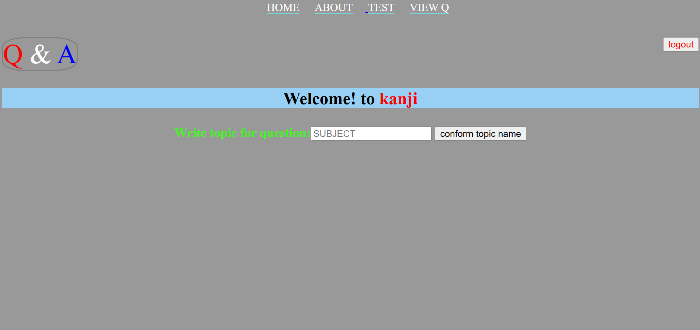
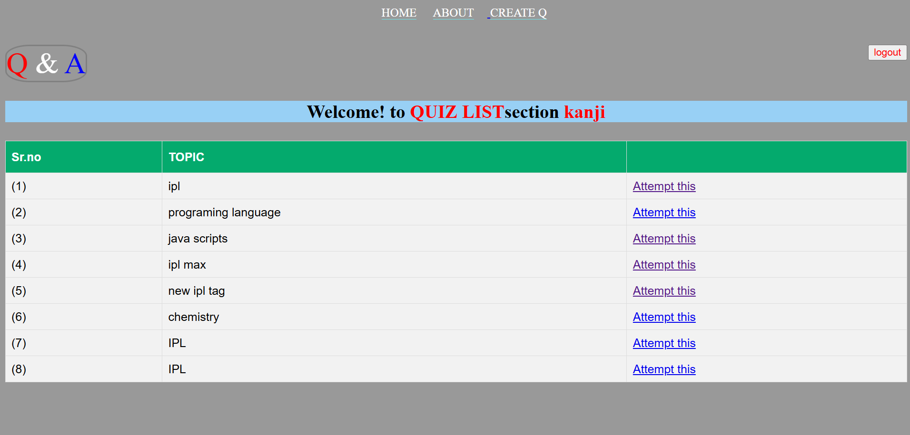
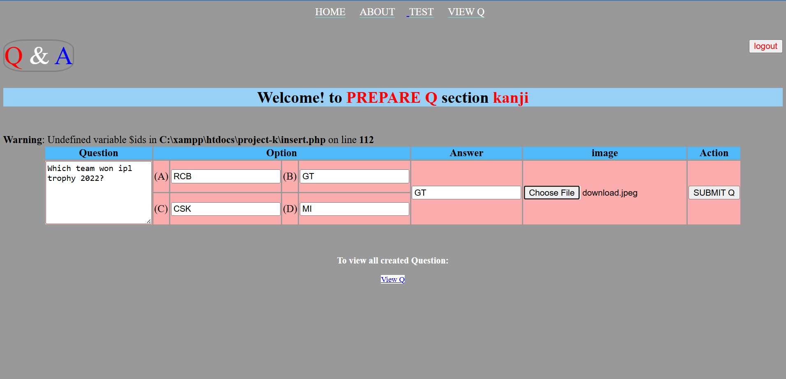
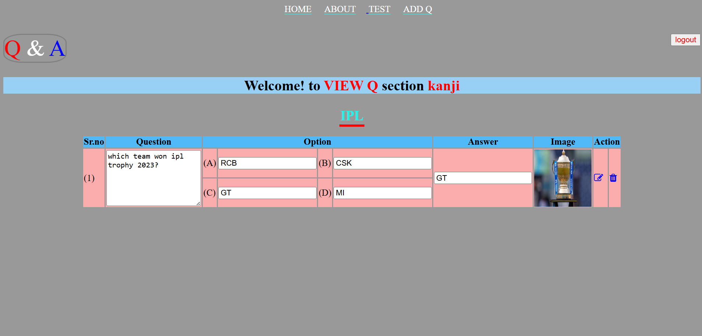
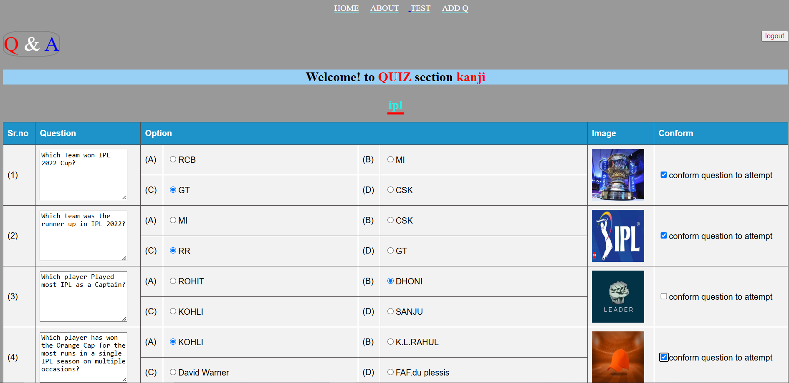

---

# 🧠 Quiz App - PHP Based

A simple yet powerful web application that allows users to register, take quizzes, and create their own quizzes. Built using **PHP**, **MySQL (phpMyAdmin)**, and **Apache Server**.

---

## 📌 Features

### 🔐 User Authentication

* User **Registration & Login** system with **CAPTCHA** verification to prevent bots.

### 📝 Quiz Participation

* Users can take any **publicly available quiz**.
* Final **score is shown** after completion of each quiz.

### ➕ Create & Manage Quizzes

* Authenticated users can **create their own quizzes**.
* Users can **Add, Update, Delete (CRUD)** questions for their quizzes.

---

## 🧰 Technologies Used

| Technology | Description                 |
| ---------- | --------------------------- |
| PHP        | Server-side scripting       |
| MySQL      | Local database (phpMyAdmin) |
| Apache     | Local development server    |
| HTML/CSS   | Frontend UI                 |
| JavaScript | Basic interactivity         |

---

## 🖼️ User Interface Screenshots

| Feature               | Image                                               |
| --------------------- | --------------------------------------------------- |
| Homepage              |                         |
| login                 |                           |
| Registraion           |                 |
| Quiz Creation Page    |                   |
| List of Quizzes       |                    |
| Question Management   |                      |
| Edit/Delete Questions |            |
| Quiz                  |                             |
| View Score            |                      |

---

## 🚀 Future Enhancements

* ⏳ **Timer** for each quiz to increase difficulty and engagement.
* 🤖 **AI Integration** for:

  * Generating questions automatically.
  * Analyzing user performance.
  * Giving recommendations for quiz topics.

---

## 🔧 Setup Instructions

1. **Clone the Repository**

   ```bash
   git clone https://github.com/kevalmadariya/Quiz-PHP.git
   ```

2. **Move to your local server (e.g., XAMPP)**

   * Place the project folder inside `/htdocs`.

3. **Database Setup**

   * Open `phpMyAdmin`.
   * Create a new database: `quiz_app`.
   * Import the provided `quiz_app.sql` file.

4. **Configure Database Connection**

   * Edit `config.php` or equivalent file with your DB credentials:

     ```php
     $host = "localhost";
     $user = "root";
     $password = "";
     $database = "quiz_app";
     ```

5. **Run the App**

   * Start Apache and MySQL from XAMPP.
   * Open in browser:

     ```
     http://localhost/quiz-app-php/
     ```

---

## 🙌 Contributions

Pull requests and feature suggestions are welcome!

---
